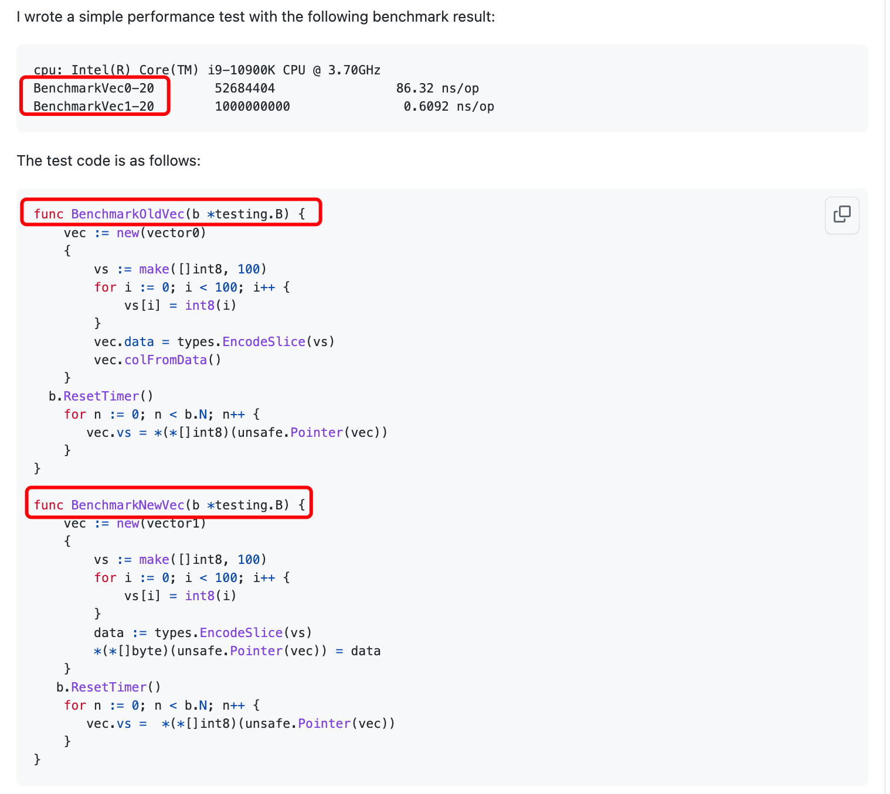

# 如何写 Benchmark

性能问题不是猜测出来的，即便我们“强烈的认为”某处代码是性能瓶颈，也必须经过验证。

> *"Those who can make you believe absurdities can make you commit atrocities" - Voltaire*

对于性能测试来说，很容易写出不准确的 Benchmark，从而形成错误的印象。

## 1. Reset or Pause timer

```go
func BenchmarkFoo(b *testing.B) {
  heavySetup()  // 在 for 循环之前执行设置工作，如果设置工作比较耗时，那么会影响测试结果的准确性
  for i := 0; i < b.N; i++ {
    foo()
  }
}
```

- 优化方式

```go
func BenchmarkFoo(b *testing.B) {
  heavySetup()
  b.ResetTimer()  // 重置 timer，保证测试结果的准确性
  for i := 0; i < b.N; i++ {
    foo()
  }
}
```

- 如何停止 timer

```go
func BenchmarkFoo(b *testing.B) {
  for i := 0; i < b.N; i++ {
    b.StopTimer() // 停止 timer
    heavySetup()
    b.StartTimer() // 启动 timer
    foo()
  }
}
```

## 2. 提高测试结果可信度

对于 Benchmark，有很多因素会影响结果的准确性：

- 机器负载情况
- 电源管理设置
- 热扩展(thermal scaling)
- ……

相同的性能测试代码，在不同的架构，操作系统下运行可能会产生截然不同的结果；

相同的 Benchmark 即便在同一台机器运行，前后也可能产生不一致的数据。

简单的方式是增加 Benchmark 运行次数或者多次运行测试来获取相对准确的结果：

- 通过 `-benchtime` 设置性能测试时间（默认 1秒）
- 通过 `-count` 多次运行 Benchmark

```go
package benchmark

import (
        "sync/atomic"
        "testing"
)

func BenchmarkAtomicStoreInt32(b *testing.B) {
        var v int32
        for i := 0; i < b.N; i++ {
                atomic.StoreInt32(&v, 1)
        }
}

func BenchmarkAtomicStoreInt64(b *testing.B) {
        var v int64
        for i := 0; i < b.N; i++ {
                atomic.StoreInt64(&v, 1)
        }
}
```

多次运行测试，得出置信度较高的结果：

```go
$ go test -bench Atomic -count 10 | tee stats.txt

$ benchstat stats.txt
goos: darwin
goarch: arm64
pkg: github.com/cnutshell/go-pearls/benchmark
                   │   stats.txt   │
                   │    sec/op     │
AtomicStoreInt32-8   0.3131n ± ∞ ¹
AtomicStoreInt64-8   0.3129n ± ∞ ¹
geomean              0.3130n
¹ need >= 6 samples for confidence interval at level 0.95
```

> 如果提示 `benchstat` 未找到，通过 `go install` 命令安装：`go install golang.org/x/perf/cmd/benchstat@latest`

## 3. 注意编译器优化会影响性能结果 

```go
package benchmark

import "testing"

const (
        m1 = 0x5555555555555555
        m2 = 0x3333333333333333
        m4 = 0x0f0f0f0f0f0f0f0f
)

func calculate(x uint64) uint64 {
        x -= (x >> 1) & m1
        x = (x & m2) + ((x >> 2) & m2)
        return (x + (x >> 4)) & m4
}

func BenchmarkCalculate(b *testing.B) {
        for i := 0; i < b.N; i++ {
                calculate(uint64(i))
        }
}

func BenchmarkCalculateEmpty(b *testing.B) {
        for i := 0; i < b.N; i++ {
                // empty body
        }
}
```

运行示例代码中的测试，两个测试的结果相同：

```bash
go test -bench Calculate
goos: darwin
goarch: arm64
pkg: github.com/cnutshell/go-pearls/benchmark
BenchmarkCalculate-8            1000000000               0.3196 ns/op
BenchmarkCalculateEmpty-8       1000000000               0.3154 ns/op
PASS
ok      github.com/cnutshell/go-pearls/benchmark        0.814s
```

## 4. 我们的代码

下面的截图来自 [Issue 6820 Comment](https://github.com/matrixorigin/matrixone/issues/6820#issuecomment-1322952552)，性能测试代码有过更新，跟性能测试数据对不上了



最初的测试代码是下面这样的：

```go
func BenchmarkNewVec(b *testing.B) {
    vec := new(vector1)
    {
        vs := make([]int8, 100)
        for i := 0; i < 100; i++ {
            vs[i] = int8(i)
        }
        data := types.EncodeSlice(vs)
        *(*[]byte)(unsafe.Pointer(vec)) = data
    }
  
    for n := 0; n < b.N; n++ {
        *(*[]int8)(unsafe.Pointer(vec))
    }
}
```

基于前面的介绍，这样的性能测试代码会产生什么结果？
