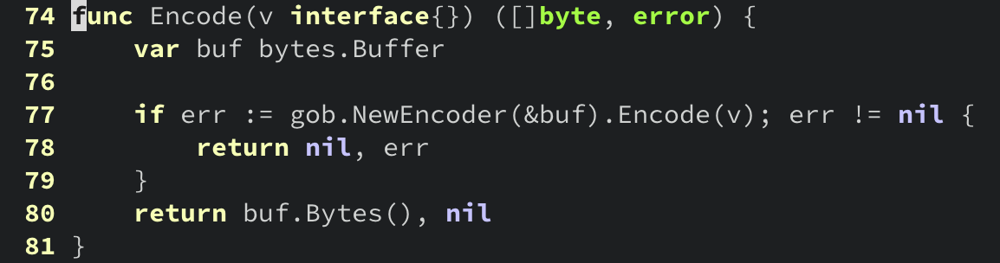
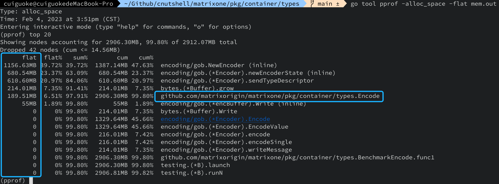
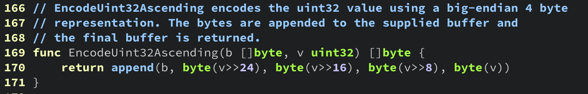

# Memory

[TOC]

## 1. escape analysis of compiler

### 1.1 示例代码

```go
package main

//go:noinline
func makeBuffer() []byte {
    return make([]byte, 1024)
}

func main() {
    buf := makeBuffer()
    for i := range buf {
        buf[i] = buf[i] + 1
    }
}
```

### 1.2 命令行

```bash
$ go build -gcflags="-m" escape.go
# command-line-arguments
./escape.go:8:6: can inline main
./escape.go:5:13: make([]byte, 1024) escapes to heap
```

### 1.3 示例说明

示例代码中函数 `makeBuffer` 返回的内存位于函数栈上，在 C 语言中，这是一段错误的代码，会导致未定义的行为。

在 Go 语言中，这样的写法是允许的。Go 编译器会执行 escape analysis：当它发现一段内存不能放置在函数栈上时，会将这段内存放置在堆内存上。例如，当一个函数向上返回栈内存时，编译器自动将这段内存放在堆内存上。

另外，还存在其他一些情况会触发内存的“逃逸”：

- 全局变量，因为它们可能被多个 goroutine 并发访问

- 通过 channel 传送指针

  ```go
  type Hello struct { name string }
  ch := make(chan *Hello, 1)
  ch <- &Hello{ name: "world"}
  ```

- 通过 channel 传送的结构体中持有指针

  ```go
  type Hello struct { name *string }
  ch := make(chan *Hello, 1)
  name := "world"
  ch <- Hello{ name: &name }
  ```

- 局部变量过大，无法放在函数栈上

- 本地变量的大小在编译时未知，例如 `s := make([]int, 1024)` 也许不会被放在堆内存上，但是 `s := make([]int, n)` 会被放在堆内存上，因为其大小 `n` 是个变量

- 对 `slice` 的 `append` 操作触发了其底层数组重新分配

注意：上面列出的情况不是详尽的，并且可能随 Go 的演进发生变化。

### 1.4 我们的代码

[github.com/matrixorigin/matrixone/pkg/container/types.Encode](https://github.com/matrixorigin/matrixone/blob/5c7ea0b214d824bad7bbf030a8403dd5a3b9e748/pkg/container/types/encoding.go#L74)



- 性能测试

```go
// github.com/matrixorigin/matrixone/pkg/container/types/encoding_test.go
var global []byte

func BenchmarkEncode(b *testing.B) {
	var local []byte
	b.Run("Encode", func(b *testing.B) {
		for i := 0; i < b.N; i++ {
			local, _ = Encode(10)
		}
	})
	global = local
}
```

- Memory Profiling

```bash
$ go test -run none -bench Encode$ -benchmem -bench -memprofile mem.out
goos: darwin
goarch: arm64
pkg: github.com/matrixorigin/matrixone/pkg/container/types
BenchmarkEncode/Encode-8         2692195           435.4 ns/op        816 B/op         11 allocs/op
PASS
ok      github.com/matrixorigin/matrixone/pkg/container/types   1.798s

$ go tool pprof -alloc_space -flat mem.out
(pprof) top 20
```



### 1.5 参考代码

[cockroach encoding code](https://github.com/cockroachdb/cockroach/blob/5fbcd8a8deac0205c7df38e340c1eb9692854383/pkg/util/encoding/encoding.go#L180)



### 1.6 总结提示

- 注意函数签名设计，尽量避免因函数签名设计不合理而导致的不必要内存分配

  > 例如，自下向上（从被调用函数到调用者）返回 slice 可能会触发内存“逃逸”

- 从内存分析来看，函数 `Encode` 存在问题较多，拿来作为 escape 的例子有点牵强，接下来看下 interface{} 作为函数参数的分析

