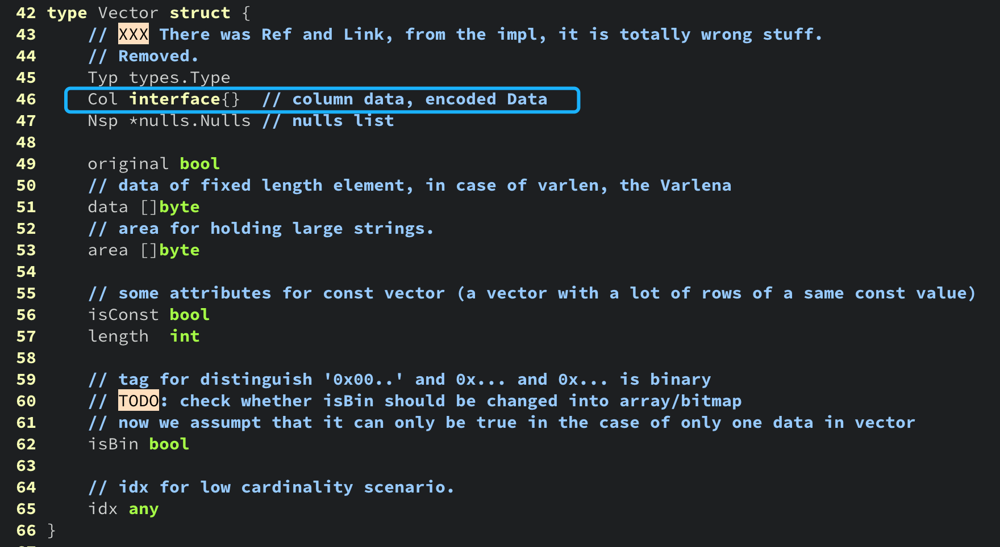

# Memory

[TOC]

## 2. interface{} / any
any 是 golang 1.18 版本引入的，跟 interface{} 等价。

[接口实现](https://github.com/golang/go/blob/3fc8ed2543091693eca514b363fcdbbe5c7f2916/src/runtime/runtime2.go#L202) 为一个“胖”指针：一个指向实际的数据，一个指向函数指针表（类似于C++ 中的虚函数表）。

```
type any = interface{}
```

### 2.1 示例代码

```go
package interfaces

import (
	"testing"
)

var global interface{}

func BenchmarkInterface(b *testing.B) {
	var local interface{}
	for i := 0; i < b.N; i++ {
		local = calculate(i) // assign value to interface{}
	}
	global = local
}

// values is bigger than single machine word.
type values struct {
	value  int
	double int
	triple int
}

func calculate(i int) values {
	return values{
		value:  i,
		double: i * 2,
		triple: i * 3,
	}
}
```

### 2.2 命令行

```bash
$ go test -run none -bench Interface -benchmem -memprofile mem.out

goos: darwin
goarch: arm64
pkg: github.com/cnutshell/go-pearls/memory/interfaces
BenchmarkInterface-8    101292834               11.80 ns/op           24 B/op          1 allocs/op
PASS
ok      github.com/cnutshell/go-pearls/memory/interfaces        2.759s

$ go tool pprof -alloc_space -flat mem.out
(pprof) top 
```

### 2.3 示例说明

向类型为 `interface{}` 的变量赋值，可能会触发内存“逃逸”，导致额外的内存分配。

在 Golang 中，基于接口实现多态，类似于 Python 支持的 `Duck Typing`。

```go
type Stringer interface {
  String() string
}

func Foo(s Stringer) {
  // do some job
}
```

基于接口实现多态，主要存在这些问题：

1. 丢失了类型信息 ，程序行为从编译阶段转移到运行阶段；
2. 程序运行阶段不可避免地需要执行类型转换，类型断言或者反射等操作；
3. 为 `interface{}` 类型的变量赋值可能会导致“额外的”内存分配；
3. 在 Golang 中，基于接口的函数调用，其实际的调用开销为：指针解引用（确定方法地址）+ 函数执行开销。编译器无法对其执行内联优化，也无法基于内联优化执行进一步的优化；

### 2.4 我们的代码

[Vector.Col](https://github.com/matrixorigin/matrixone/blob/9a3b0a2bc7a44092d06f42d2dc16ba55d22a9b5c/pkg/container/vector/vector.go#L46)



- The following is the benchmark for [Vector.Col](https://github.com/matrixorigin/matrixone/blob/56bc90513f2d5dfeb21c3ecbb75c286507d58401/pkg/container/vector/vector.go#L44):

```go
func randInt8Slice(length int) []int8 {
    s := make([]int8, length)
    for i := 0; i < len(s); i++ {
        s[i] = int8(rand.Intn(math.MaxInt8))
    }
    return s
}

var gi interface{}

func BenchmarkVector(b *testing.B) {
    mp := mpool.MustNewZero()

    vs := make([]*Vector, 30000)
    for i := 0; i < len(vs); i++ {
        v := New(types.Type{Oid: types.T(types.T_int8)})
        v.data = mustMakeSliceArgsAsBytes(mp, randInt8Slice(24)...)
        vs[i] = v
    }

    b.ResetTimer()
    var li interface{}
    for i := 0; i < b.N; i++ {
        v := vs[i%len(vs)]
        li = types.DecodeSlice[int8](v.data)
    }
    gi = li
}
```

Place this code in file `github.com/matrixorigin/matrixone/pkg/container/vector/vector_test.go`, then run it:

```bash
$ go test -run none -bench Vector -benchmem -memprofile mem.out
goos: darwin
goarch: arm64
pkg: github.com/matrixorigin/matrixone/pkg/container/vector
BenchmarkVector-8       54177700                21.40 ns/op           24 B/op          1 allocs/op
PASS
ok      github.com/matrixorigin/matrixone/pkg/container/vector  1.812s

$ go tool pprof -alloc_space mem.out
(pprof) top
```

Via `go tool pprof -alloc_space mem.out`, the allocated memory lies in where we assign `unsafe.Slice` to an interface. In order to get rid of this unnecessary heap allocation, we must assign the value returned by `unsafe.Slice` to its corresponding concrete type. (In this benchmark, the corresponding concrete type of `li` should be `[]int8`. Change the type of variable `li` from `interface{}` as `[]int8`, then rerun this benchmark, you would see that here was no allocation each operation.)

Hence there are two ways to optimize:

1. change the type of field `Vector.Col` from `interface` as concrete type `[]T`;
2. or get rid of `Vector.Col`, access the underlying data via `unsafe.Pointer` where `Vector.Col` is needed.

### 2.5 总结提示

1. 代码中避免使用 `interface{}` 或者 `any`，至少避免在被频繁使用的数据结构或者函数中使用；
2. go 1.18 引入了范型，将 `interface{}` 改为范型类型，是避免额外内存分配，优化程序性能的一个手段；
2. 介绍完 golang 编译器内存逃逸和 interface{}，下面介绍下 golang gc；

### 2.6 参考资料

[Blog: Go Data Structures: Interfaces](https://research.swtch.com/interfaces)

[Comment: Benchmark for Vector.Col](https://github.com/matrixorigin/matrixone/issues/6820#issuecomment-1324519061)

